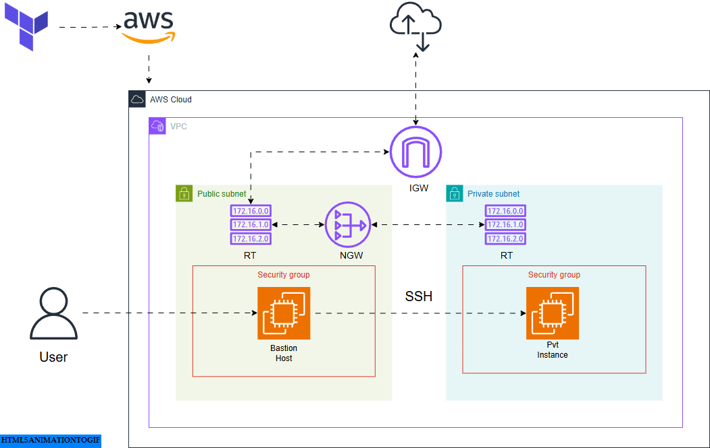

#  AWS Bastion Host Architecture with Terraform

## 📘 Overview

This project uses Terraform to create a secure and modular AWS environment. It includes a **custom VPC**, **public and private subnets**, a **bastion host**, and a **private EC2 instance** accessed through the bastion host.

Internet access for private instances is enabled via a **NAT Gateway**, while direct SSH access is only allowed through the bastion host using defined **Security Groups**.

---

## ✨ Features

- Custom **VPC**, **Public**, and **Private Subnets**
- **Bastion Host** in public subnet with SSH access
- **Private EC2 Instance** accessible only via the Bastion Host
- **NAT Gateway** to provide internet to private subnet
- **Elastic IP** for NAT Gateway
- **Internet Gateway (IGW)** for public subnet
- Proper **Routing Tables** for public and private communication
- Uses **Terraform Variables** for flexibility

---

## 📦 Variables Used

| Variable Name           | Description                                 |
|-------------------------|---------------------------------------------|
| `region`                | AWS region to deploy resources              |
| `vpc_cid`               | CIDR block for the VPC                      |
| `public_subnet_cid`     | CIDR block for the public subnet            |
| `private_subnet_cid`    | CIDR block for the private subnet           |
| `key_name`              | EC2 Key Pair name                           |
| `ec2_ami`               | AMI ID for EC2 instances                    |
| `ec2_instance_type`     | EC2 instance type (e.g., `t2.micro`)        |

---

## 🧱 Architecture Components

- `aws_vpc` – Main virtual private cloud
- `aws_subnet` – One public and one private subnet
- `aws_internet_gateway` – Internet access for public subnet
- `aws_nat_gateway` – NAT access for private subnet
- `aws_route_table` – Separate routing for public and private traffic
- `aws_security_group` – Two SGs:
  - Public SG allows SSH from your IP
  - Private SG allows SSH only from Bastion Host
- `aws_instance` – 
  - Bastion Host in public subnet
  - Private EC2 in private subnet

---
